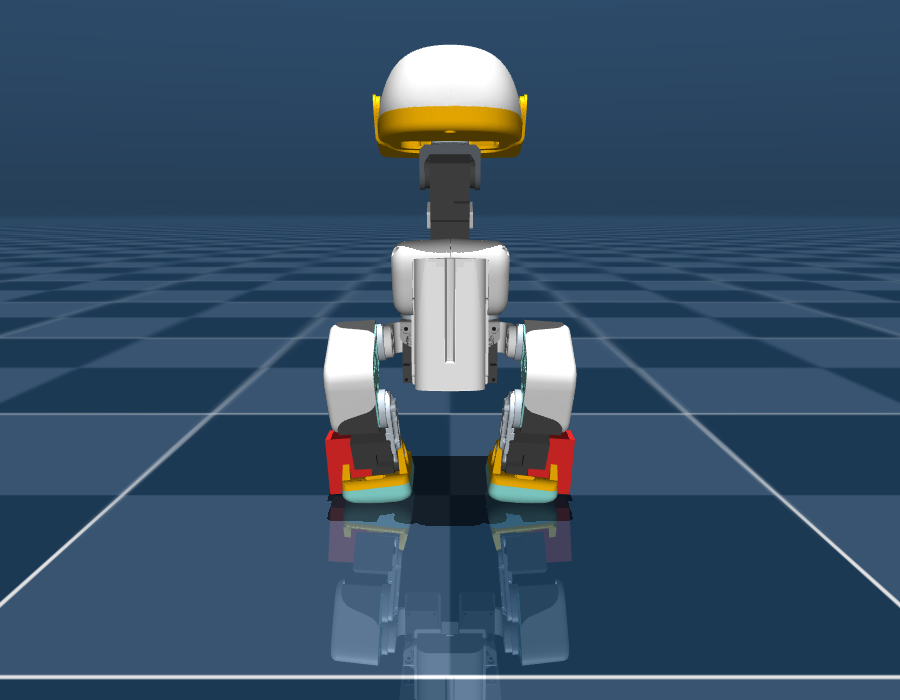
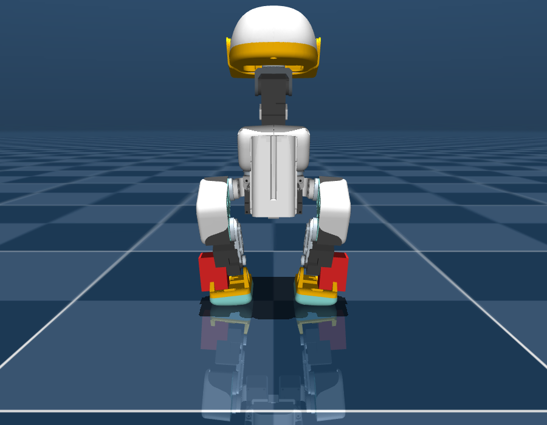
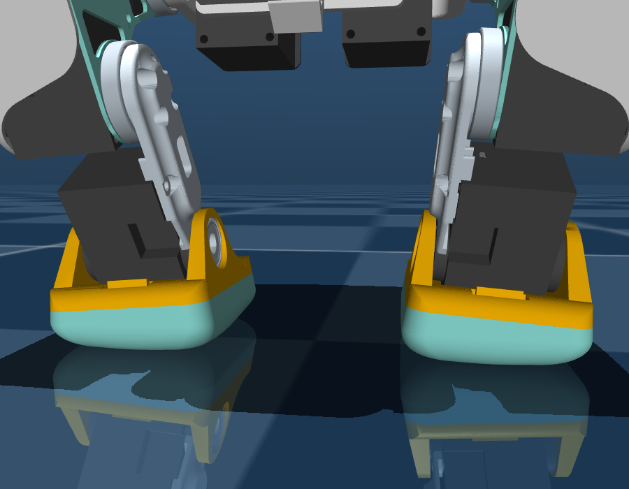
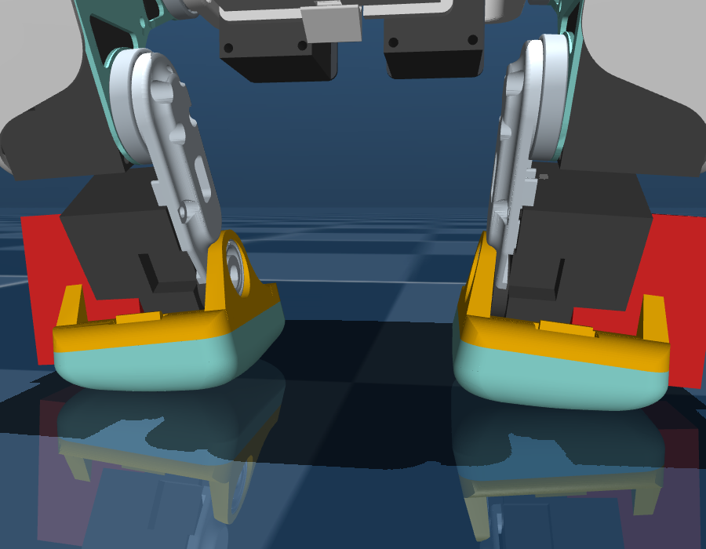
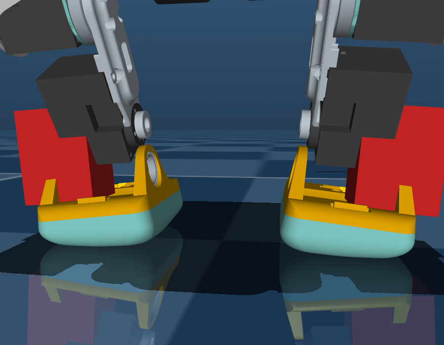
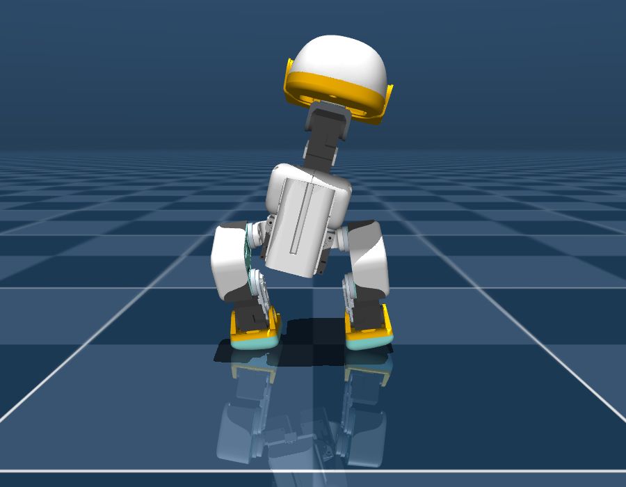
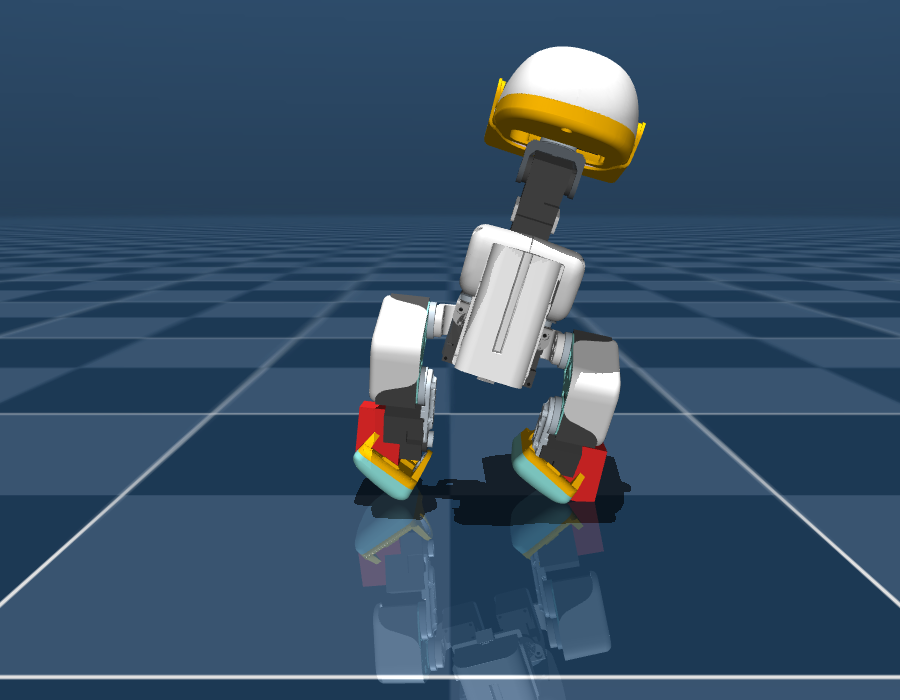
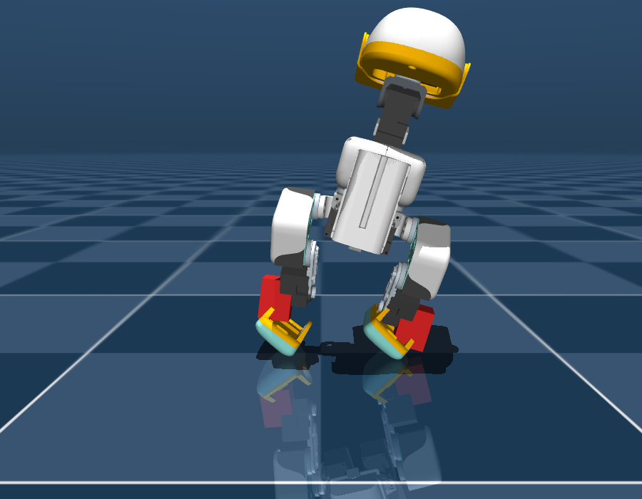

# E4b — Ankle roll: mô phỏng thật, không phải hình học

Bản E4 trước (`docs/e4-hardware-tradeoff.md`) nói ankle roll cho **+81%** khả
năng chịu đẩy ngang. Con số đó **không phải mô phỏng**: nó là hình học tĩnh, cộng
thêm 20 g mỗi mắt cá làm đại diện, và *giả định* bàn chân giữ phẳng. Không có
khớp mới, không có actuator mới, không có tiếp xúc mới.

Tài liệu này thay thế con số đó bằng một robot 16 servo thật và các rollout
MuJoCo thật.

```bash
uv run python scripts/ankle_roll_variant.py      # sinh MJCF 16 servo (2 biến thể)
uv run python scripts/ankle_roll_variant.py --robot robot_allcollisions --scene scene
uv run python scripts/ankle_roll_sim.py --only t0 t1 t2
uv run python scripts/ankle_roll_sim.py --only t3 --walking <alpha_walking.onnx>
uv run python scripts/ankle_roll_render.py --out docs/img
```

## 1. Cái đã dựng

Mỗi chân được thêm **một hinge `*_ankle_roll` thật** (±30°), **một actuator
position thật** (cùng class servo `chosen_actuator`, forcerange ±0.96 N·m), khối
lượng + quán tính của servo/bracket (20 g, hộp 20×34×26 mm), và một khối hộp đỏ
chỉ để nhìn thấy servo nằm ở đâu. Bàn chân và toàn bộ hình học va chạm được
chuyển xuống làm *con* của khớp mới, nên khớp mới thực sự đổi hướng bàn chân và
đổi tiếp xúc với sàn.

Hai cách bắt servo — vì cách bắt là phần lớn chi phí:

| | `coincident` | `serial` |
|---|---|---|
| trục roll | trùng vùng trục pitch (servo bắt cạnh) | xếp **dưới** servo pitch |
| chiều dài chân | không đổi | **+18 mm** |
| nu / njnt | 16 / 17 | 16 / 17 |
| khối lượng | 0.737 → **0.777 kg** | 0.737 → **0.777 kg** |
| CoM trên đế | 0.1389 → **0.1329 m** (thấp hơn) | 0.1389 → **0.1490 m** (cao hơn 10 mm) |

Kiểm tra tương đương: ở `ankle_roll = 0`, biến thể `coincident` cho vị trí geom
bàn chân **trùng khít** baseline (`0.00685 0.04066 0.00859`), nên chênh lệch mọi
test chỉ đến từ 40 g và từ khớp mới — không phải từ lỗi dựng model.

| | baseline | coincident | serial |
|---|---|---|---|
| đứng STAND |  |  |  |
| cận mắt cá |  |  |  |
| nghiêng ngang tối đa **còn phẳng cả hai đế** |  |  |  |

Hàng cuối là ảnh đáng nhìn nhất: cùng một lệnh nghiêng, baseline gần như không
dịch được thân, hai bản ankle roll đưa cả thân sang ~40 mm mà hai đế vẫn dán sàn.

## 2. Kết quả bốn bài test

Cả bốn bài chạy trên cùng một controller cho cả ba robot, gain được **dò riêng
cho từng robot** (baseline không bị bắt dùng gain chọn cho robot ankle roll).

| | baseline (14) | coincident (16) | serial (16) |
|---|---|---|---|
| T0 nghiêng sau 3 s từ init nhiễu | 1.13° | 1.05° | 1.17° |
| T0 hai chân tiếp đất | 5/5 | 5/5 | 5/5 |
| **T2 CoM dịch ngang khi đế còn phẳng** | **2.6 mm** | **40.7 mm** | **46.5 mm** |
| **T1 chịu đẩy NGANG tối đa** | **0.598 m/s** | **0.629 m/s** (+5.2%) | **0.553 m/s** (−7.7%) |
| T1 chịu đẩy DỌC tối đa | 0.263 m/s | 0.279 m/s | 0.248 m/s |
| T1 gain ankle roll được chọn (ngang) | — | **0.0** | **0.0** |
| T3 tốc độ đi với policy hôm nay | 0.163 m/s | **0.127 m/s** (−22%) | 0.198 m/s (+22%) |
| T3 dải min–max (5 rollout) | 0.152–0.170 | 0.060–0.147 | 0.165–0.210 |
| T3 số lần ngã | 0/5 | 0/5 | 0/5 |
| T3 tỷ lệ bão hoà moment | 0.4% | 0.0% | 3.1% |

## 3. Đọc bảng này thế nào — và tại sao bạn nói đúng

**Bạn đúng: tôi đã đánh giá quá cao ankle roll.** Nhưng chỗ sai không phải ở
hình học, mà ở chỗ tôi đã coi *khả năng cơ khí* là *hiệu năng của robot*.

**1. Khả năng cơ khí là thật, và rất lớn: 2.6 mm → 40.7 mm (gấp ~16 lần).**
Đây chính là 40 mm mà E4 tính ra bằng hình học — mô phỏng xác nhận. Không có
ankle roll, robot **hầu như không thể dịch thân sang ngang mà giữ cả hai đế
phẳng**: hông xoay đến đâu bàn chân lật lên cạnh đến đó, và 40 mm "với ngang"
trên giấy chỉ còn 2.6 mm dùng được trong thực tế. Đây là giới hạn thiết kế rõ
ràng nhất tôi đo được của microduck.

**2. Nhưng khả năng đó KHÔNG tự biến thành chống đẩy tốt hơn: +5.2%, tức trong
khoảng nhiễu.** Và bằng chứng mạnh nhất: bộ dò gain, khi được tự do chọn, đã
chọn **gain ankle roll = 0** cho trục ngang trên cả hai biến thể — với một
controller đứng-tại-chỗ, khớp mới *không có ích gì*, thậm chí phản hồi nghiêng
đặt lên nó còn chống lại việc dịch thân. Lý do vật lý: chống đẩy khi **đứng** bị
giới hạn bởi bề rộng bàn chân (CoP), chứ không phải bởi tầm với ngang. Tầm với
ngang chỉ có giá khi robot **bước** sang bên và cần đặt đế phẳng ở vị trí mới.

**Đó là câu trả lời cho câu hỏi của bạn — "nếu tốt vậy sao microduck chưa làm".**
Ankle roll không phải nâng cấp phần cứng cho khả năng có sẵn; nó là **quyền năng
chỉ tồn tại nếu policy học dùng nó để bước ngang**. Thêm 2 servo mà giữ nguyên
lớp điều khiển thì gần như chắc chắn không thấy gì — đúng như bảng trên. Với
microduck (14 servo, 61D obs, 9 policy dùng chung contract), cái giá là phá
contract và train lại toàn bộ; lợi ích thì chỉ hiện ra *sau* khi train lại. Đó
là một đánh cược, không phải một cải tiến.

**3. Chi phí thì hiện ra ngay, không cần train.** Policy đang deploy vẫn đi được
trên cả hai bản (0/5 ngã) — phần cứng mới không làm robot ngã — nhưng bản
`coincident` **chậm đi 22%** và phương sai tăng vọt (0.060–0.147 so với
0.152–0.170), tức 40 g ở mắt cá đủ làm lệch dáng đi đã train. Bản `serial` đi
*nhanh hơn* 22% (chân dài hơn → sải dài hơn) nhưng phải trả bằng CoM cao hơn
10 mm, bão hoà moment gấp 8 lần, và **chống đẩy ngang kém hơn baseline 7.7%** —
tức cách bắt servo kiểu xếp tầng là hướng sai.

**4. Nếu làm, phải là `coincident`.** Cùng số servo, cùng khối lượng, nhưng CoM
*thấp hơn* baseline 6 mm (40 g nằm dưới thấp), giữ nguyên chiều dài chân, và là
bản duy nhất không làm xấu trục mà E0 đo được là trục hay ngã.

## 4. Kết luận và thứ tự việc

**Chưa thêm ankle roll bây giờ.** Không phải vì nó vô dụng, mà vì giá trị của nó
nằm sau một policy chưa tồn tại. Thứ tự đúng vẫn là:

1. **In lại bàn chân** (rộng +10 mm, dài +5 mm) — không thêm servo, không phá
   contract 61D, ~0 g. Đây vẫn là món rẻ nhất trên bàn.
2. **E1 → E2 → E3 trên 14 servo** (task agile, ký ức GRU, transfer chịu trễ).
3. **Chỉ sau đó** mới đổi phần cứng một lần: `coincident` ankle roll, 16 action,
   obs 61 → 67, và train **có** ankle roll ngay từ đầu cùng reward thưởng bước
   ngang. Không train lại thì 2 servo này là 40 g chết.

## 5. Giới hạn của chính tài liệu này (đọc trước khi tin)

- **Tất cả là mô phỏng, chưa có gì chạy trên robot thật.** Không có bracket CAD,
  20 g là ước lượng XL330 + bracket in, khối hộp đỏ trong ảnh là bao ngoài để
  nhìn chứ không phải chi tiết cơ khí.
- **Controller trong T1/T2 là viết tay, không phải học.** Nên các con số tuyệt
  đối là *chặn dưới* cho cả ba robot; chỉ so sánh giữa các cột mới có nghĩa. Đặc
  biệt, T1 **không** chứng minh "ankle roll vô dụng" — nó chứng minh "ankle roll
  vô dụng với controller không bước". Bài test quyết định (policy 16 action biết
  bước ngang) **cần GPU** nên đang bị hoãn.
- T3 dùng đúng `alpha_walking.onnx` đang deploy: 14 action lái 14 khớp gốc, hai
  khớp roll giữ 0. Nó trả lời "phần cứng mới có làm hỏng dáng đi hôm nay không",
  **không** trả lời "ankle roll đi tốt hơn không".
- Một phát hiện phụ đáng ghi: MJCF đang ship (`scene_walk.xml`, actuator
  `position kp=0.55`) **không tự đứng được** ở keyframe STAND — giữ ctrl = STAND
  thì robot sụp trong ~1 s. Mọi bài test đứng ở đây vì thế phải chạy vòng kín
  (kp ≥ 2 rad/rad nghiêng). Điều này khớp với E0 (policy `alpha_stand` ngã sau
  2.6–5.5 s) và là lý do không nên dùng "giữ nguyên ctrl" làm phép thử tư thế.
- Biến thể `serial` cần nâng z của keyframe thêm 18 mm, nếu không robot spawn
  chìm trong sàn — `scripts/ankle_roll_variant.py` làm việc này tự động.
